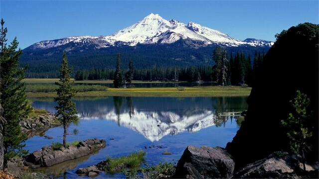

__Civil Services__ is a collection of tools that make it possible for citizens to be apart of what is happening in their Local, State & Federal Governments.

Unites States of America
===

[](https://raw.githubusercontent.com/CivilServiceUSA/us-states/master/LICENSE)  [](https://github.com/CivilServiceUSA/us-states/graphs/contributors)

This data was collected specifically for use on our [Civil Services](https://civil.services) website.  We felt others could benefit from this data so we released it as a standalone project with MIT Licensing.  If you end up using this data in your project, we would love to know.  You can email us at [hello@civil.services](mailto:hello@civil.services).


State Background Images
---

Civil Services created high-resolution Landscape & Skyline Background Images for each US State and made them available in the following sizes:

* 640 x 360
* 960 x 540
* 1280 x 720
* 1920 x 1080

#### Landscape Images

The Landscape image ( `landscape_background_url` ) are nice images of landscapes you can find in each state.

The default size is `1280x720`.  You will need to replace that string in the URL if you wish to use a different size.

__Sample Image__



#### Skyline Images

The Skyline image ( `skyline_background_url` ) are nice images of city skylines you can find in each state.

The default size is `1280x720`.  You will need to replace that string in the URL if you wish to use a different size.

__Sample Image__


__NOTE:__  All images were optimized for a balance in quality and file size.

State Flag Images
---

There are two sizes for each `state_flag_url`.

* `idaho-small.png` ( all small flags are 150 x 100 pixels )
* `idaho-large.png` ( all large flags are 600 x 400 pixels )

The default size listed in the data set is suffixed with `-large.jpg`.  You will need to replace that string in the URL if you wish to use a different size.

__Sample Image__


__NOTE:__  All images were optimized for a balance in quality and file size.


State Seal Images
---

There are two sizes for each `state_seal_url`.

* `california-small.png` ( vary in size & shape )
* `california-large.png` ( vary in size & shape )

The default size listed in the data set is suffixed with `-large.jpg`.  You will need to replace that string in the URL if you wish to use a different size.

__Sample Image__


__NOTE:__  All images were optimized for a balance in quality and file size.


State Map Images
---

There are two sizes for each `map_image_url`.

* `delaware-small.png` ( all small maps are 137 x 100 pixels )
* `delaware-large.png` ( all large maps are 756 x 550 pixels )

The default size listed in the data set is suffixed with `-large.jpg`.  You will need to replace that string in the URL if you wish to use a different size.

__Sample Image__


__NOTE:__  All images were optimized for a balance in quality and file size.


CDN Image Usage
---

You can either copy the `./images/` folder into your project, or we also offer a CDN.

If you are using the image `./images/backgrounds/1280x720/landscape/alabama.jpg` the CDN for that file would be `https://cdn.civil.services/us-states/backgrounds/1280x720/landscape/alabama.jpg`


State Data
---

This project offers data for the United States in the following formats:

* [CSV](data/states.csv)
* [JSON](data/states.json)
* [SQL](data/states.sql) & [SQL Table](data/states.table.sql) 
* [XML](data/states.xml)
* [YML](data/states.yml)


Data Set
---

The following information is available for each US Senator.

property                   | type   | description
---------------------------|--------|------------
`state`                    | string | Full Name of State
`slug`                     | string | Slug of State Name ( lower case letters with spaces replaced with dashes )
`code`                     | string | Two Letter Abbreviation of State
`nickname`                 | string | Official State Nickname
`website`                  | string | Official URL of States Government Website
`admission_date`           | date   | Date State was Admitted into the United States
`admission_number`         | number | What number the US State Joined the United States
`capital_city`             | string | Name of States Capital
`capital_url`              | string | URL of States Capital
`population`               | number | US Census Population of State
`population_rank`          | number | Rank of States Population against other States
`constitution_url`         | string | URL of State Constitution
`state_flag_url`           | string | URL of State Flag
`state_seal_url`           | string | URL of State Seal
`map_image_url`            | string | URL of US Map with Highlighted State
`landscape_background_url` | string | Background Image URL showing Popular Landscape of State
`skyline_background_url`   | string | Background Image URL showing Popular Skyline of State ( Available in 640x360, 960x540, 1280x720, 1920x1080 )
`twitter_url`              | string | Official State Twitter URL
`facebook_url`             | string | Official State Facebook URL

Developers
---

The main data file is `data/states.json` and is the only one you need to make changes too.  Once changes are made
you can automatically generate the CSV, SQL, XML & YML files automagically by running the following in a terminal window:

```bash
npm install
npm run convert
```